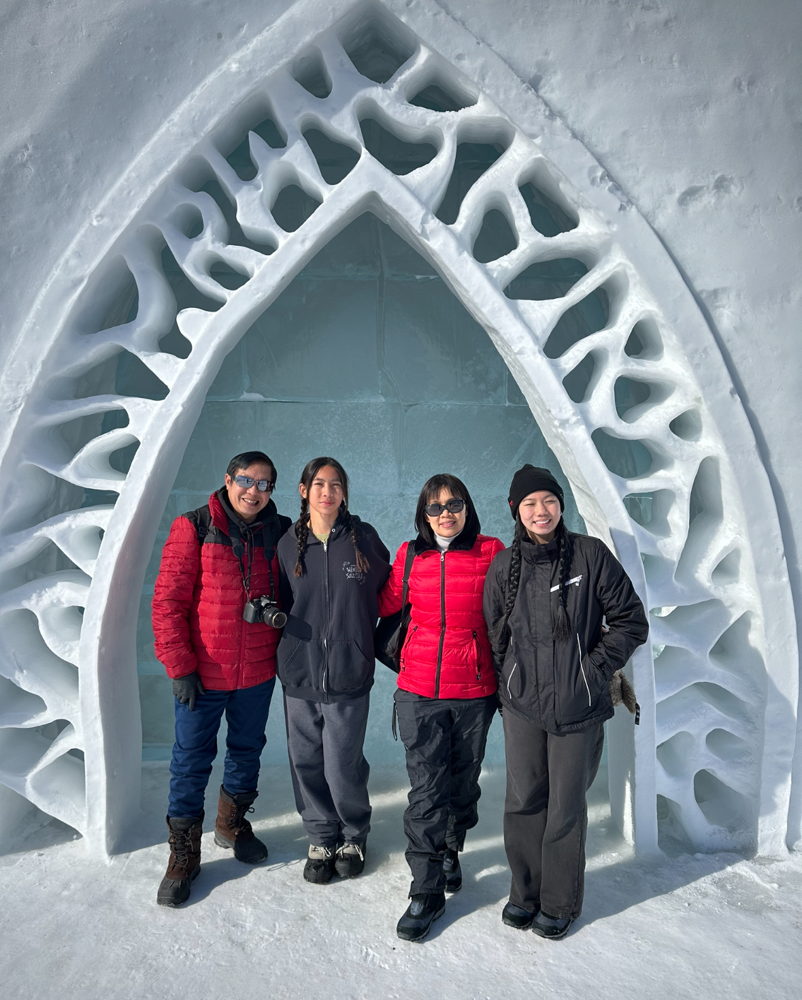
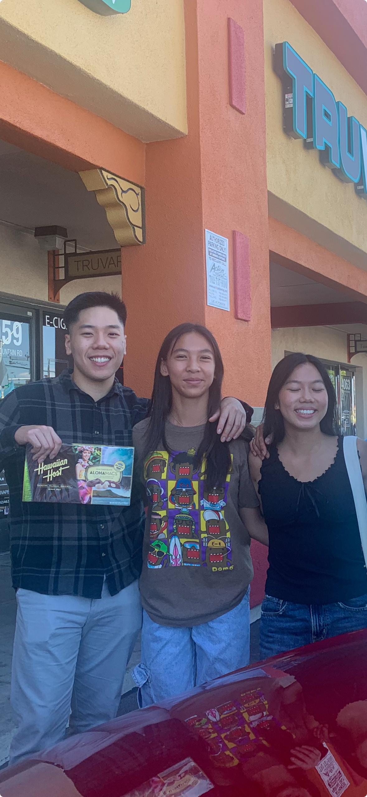

# ALL ABOUT HALEY!

## Family Info
  - I come from a family of 4 (my mom, dad, and younger sister)
  
      
  - I also have a half-brother (**Jason**) who is 4 years older than me and 8 years older than my younger sister (**Hayden**)
  

  - I also have a super cute dog named **Bambi**
  

## Random Facts
  - My personality type used to be ***ISTP*** but after retaking the test, it's now ***ISFJ*** ([Take the personality test if you're interested](https://www.16personalities.com/))

      > Defenders are very dedicated and warm protectors, always ready to defend their loved ones. These unassuming types are efficient and          responsible, always opting for practicality in life (16personalities).

  - My family loves to travel
  

  - I don't really have a favorite programming language, but I do enjoy programming in *python* and *java*
  
  ## My Favorite git commands
    - `git add`
    - `git commit`
    - `git push`

  ## Classes I need to take until I can graduate
  - [ ] cse 141 & 141l or 142 & 142l
  - [ ] cse 120 or 123 or 124
  - [ ] cse 130 or 132a
  - [ ] cse 107 or 127
  - [ ] elective 1
  - [ ] elective 2
  - [ ] elective 3

## Hobbies
  1. Going to the [gym](https://www.cdc.gov/physicalactivity/basics/pahealth/index.htm#:~:text=Regular%20physical%20activity%20is%20one,ability%20to%20do%20everyday%20activities.)
  2. Going out with friends (shopping, dining, interacting with nature (maybe))
  3. Watching [dramas](https://www.viki.com/collections/2970858l-top-tier-korean-and-chinese-dramas) (I've been really into Asian dramas recently)

## Top 3 Cuisines
  1. ***Vietnamese*** food :on::top:
  2. ***Korean*** food
  3. ***Italian*** food

## Plans for the future
  - I really want to explore ui/ux more in-depth because it's something I've been interested in
  - I'm hoping to get an internship some time second or third year
  - I have plans to start a personal project (starting it has been very difficult however :face_with_spiral_eyes:)

***[SUPER IMPORTANT INFORMATION](SUPERIMPORTANT.md)***
